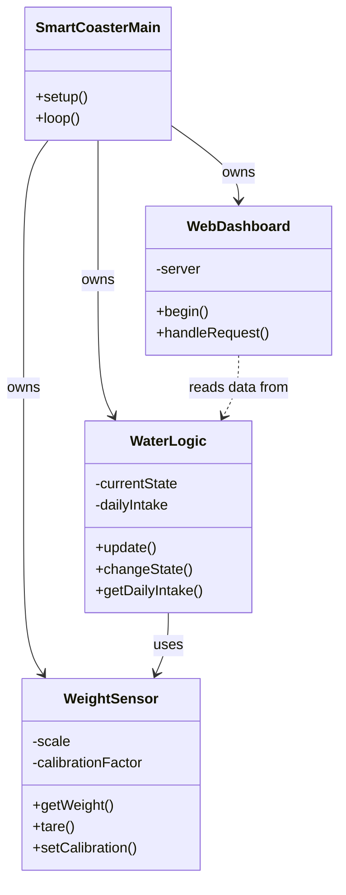
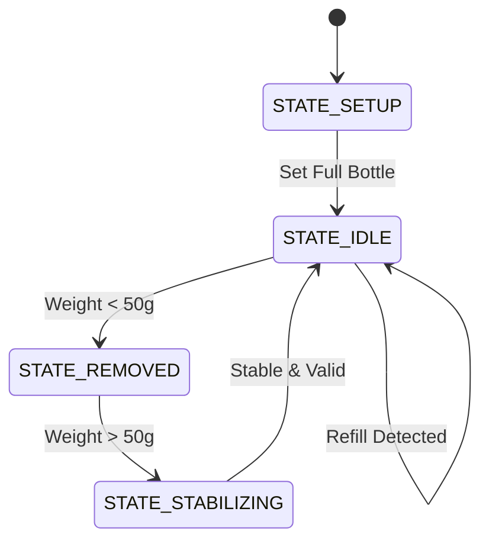

# Project Presentation: SmartCoaster Water Tracker

## Abstract

This project presents the design and implementation of "SmartCoaster," a smart IoT-based coaster designed to automatically track daily water consumption. Adequate hydration is critical for health, yet manual tracking remains inconsistent. The objective of this work was to create a non-intrusive, automated system that precisely measures water intake using weight differentials. The system is built upon an ESP32 microcontroller, an HX711 24-bit ADC, and a load cell sensor. The software architecture features a custom "WaterLogic" engine that handles calibration, detects stable weight readings, and intelligently differentiates between "lifting for drinking," "refilling," and "sensor noise." A dedicated Web Dashboard was developed to provide real-time feedback, displaying total water consumed and current bottle status. Experimental results confirm the system's ability to accurately record consumption events while ignoring potential false positives caused by vibrations or bottle movement. The final prototype offers a seamless user experience with persistent calibration settings and state management, successfully demonstrating the viability of weight-based telemetry for personal health applications.

## 1. Introduction

### 1.1 Problem Statement
Maintaining adequate hydration is a fundamental aspect of personal health, influencing cognitive function, physical performance, and overall well-being. However, despite its importance, many individuals struggle to track their daily water intake accurately. Manual methods, such as logging cups in a mobile app or using marked bottles, are often forgotten or prone to estimation errors. There is a lack of seamless, automated solutions that can integrate into a user's daily routine without requiring constant manual input.

### 1.2 Motivation
The primary motivation behind this project is to bridge the gap between necessary health monitoring and user convenience. By leveraging the Internet of Things (IoT), we can transform a mundane object—a coaster—into an intelligent health companion. Automating the tracking process eliminates user error and provides a "set it and forget it" experience. Furthermore, real-time feedback via a web dashboard encourages users to reach their hydration goals, fostering better habits through data visibility.

### 1.3 Scope
The scope of this project encompasses the end-to-end design and implementation of an embedded system named 'SmartCoaster'. Key components of the scope include:
*   **Hardware Design:** Interfacing an ESP32 microcontroller with a Load Cell (weight sensor) and HX711 amplifier to detect minute changes in weight.
*   **Embedded Software:** Developing a robust algorithm (WaterLogic) to distinguish between drinking events, bottle refills, and environmental noise.
*   **User Interface:** rapid development of a Web Dashboard hosted directly on the ESP32 for real-time monitoring and configuration.
*   **Calibration & Persistence:** Implementing a user-friendly calibration mechanism and saving configuration data to Non-Volatile Storage (NVS) for reliability.

This system is designed as a prototype to demonstrate the efficacy of weight-based fluid tracking in a compact, standalone form factor.

## 2. Background and Related Work

### 2.1 IoT in Personal Healthcare
The Internet of Things (IoT) has revolutionized personal healthcare by enabling continuous, non-invasive monitoring of physiological parameters. Devices such as smartwatches, fitness trackers, and connected scales have normalized the collection of health data. However, nutrition and hydration tracking largely remain manual processes, creating a gap in the holistic health data ecosystem.

### 2.2 Weight Measurement Technology
Resistive Load Cells are the industry standard for precise weight measurement. They operate on the principle of the Wheatstone bridge, where physical deformation causes a measurable change in resistance.
*   **Strain Gauges:** The core component that translates force into electrical resistance.
*   **HX711 Amplifier:** A precision 24-bit analog-to-digital converter (ADC) designed for weigh scales. It is essential for amplifying the minute voltage differences from the load cell to a level readable by a microcontroller.

### 2.3 Existing Solution Analysis
Current market solutions for hydration tracking primarily fall into two categories:
1.  **Smart Bottles:** Containers with built-in electronics (e.g., HidrateSpark). While effective, they are often expensive, dishwasher-unfriendly, and require the user to carry a specific bottle everywhere.
2.  **Mobile Apps:** Rely entirely on user memory and manual input, leading to high abandonment rates.

### 2.4 The Smart Coaster Approach
A smart coaster offers a unique value proposition: it is device-agnostic (works with any cup or bottle) and completely passive. The user simply places their drink on the surface, and the system handles the rest. This approach minimizes user friction and maximizes data consistency.

## 3. System Requirements

### 3.1 Functional Requirements
The system adheres to the following functional requirements to ensure accurate tracking and user interaction:
*   **FR-01 Weight Measurement:** The system shall measure the weight of the object placed on it with a precision of at least 1 gram using the HX711 load cell amplifier.
*   **FR-02 Lifting Detection:** The system shall detect when the bottle is lifted from the coaster (weight drops near zero) and transition to a `STATE_REMOVED` state.
*   **FR-03 Consumption Calculation:** Upon placing the bottle back, the system shall calculate the difference between the previous stable weight and the new weight. If the weight has decreased, it shall register the difference as water consumed.
*   **FR-04 Stabilization Delay:** The system shall wait for a stabilization period (defined as 2000 milliseconds) after weight changes to ensure readings are accurate before updating the state.
*   **FR-05 Refill Detection:** The system shall provide a manual trigger or automatic logic to detect when the bottle has been refilled (weight increases significantly) and reset the tracking baseline without adding to the consumption count.
*   **FR-06 Web Dashboard:** The system shall host a web server acting as a user dashboard, accessible via a standard web browser on the local network.
*   **FR-07 Calibration Logic:** The system shall provide a web-based interface for calibrating the scale using a known weight and save the calibration factor to Non-Volatile Storage (NVS).
*   **FR-08 Data Persistence:** The system shall save the calibration factor and daily goal settings to flash memory (NVS) to survive power cycles.

### 3.2 Non-Functional Requirements
The system works under specific constraints to ensure reliability and usability:
*   **NFR-01 Response Time:** The web dashboard shall update the displayed weight and status state within 2 seconds of a physical change occurring.
*   **NFR-02 Accuracy:** The weight measurement shall be accurate within ±5% of the actual weight to provide meaningful hydration data.
*   **NFR-03 Connectivity:** The system shall maintain a stable Wi-Fi connection to the local network for dashboard accessibility.
*   **NFR-04 Filtering:** The system shall implement a moving average filter to smoothing out sensor noise and prevent erratic readings from small vibrations.
*   **NFR-05 Usability:** The calibration process shall be guided and completeable within 1 minute by a non-technical user.

## 4. System Architecture and Design

### 4.1 Hardware Architecture
The hardware design follows a tiered architecture centered around the ESP32 microcontroller. The physical layer consists of a load cell structure that supports the drink container.
*   **Microcontroller:** ESP32 (Wi-Fi enabled, dual-core). Handles sensor data acquisition, logic processing, and web server hosting.
*   **Sensor Interface:** HX711 24-bit ADC module. It acts as a bridge between the analog load cell and the digital ESP32, providing high-precision weight data.
*   **Power:** 5V USB power supply.

```mermaid
graph LR
    subgraph "Physical Layer"
    LC[Load Cell<br/>(Strain Gauge)]
    end
    
    subgraph "Signal Processing"
    HX[HX711 ADC<br/>Amplifier]
    end
    
    subgraph "Processing Unit"
    ESP[ESP32 Microcontroller]
    WIFI[Wi-Fi Module]
    NVS[NVS Flash Memory]
    end
    
    subgraph "User Interface"
    WEB[Web Dashboard<br/>(HTML/JS)]
    end

    LC -->|Analog Signal| HX
    HX -->|Digital Data (DT/SCK)| ESP
    ESP <-->|Read/Write| NVS
    ESP -->|HTTP/Websocket| WEB
    WEB -->|User Input| ESP
```

### 4.2 Software Architecture
The software is designed using a modular object-oriented approach in C++ (Arduino Framework). The system is divided into three main components:

1.  **WeightSensor Module:** Abstraction layer for the HX711. It handles:
    *   Raw data acquisition.
    *   Taring (zeroing).
    *   Applying calibration factors to convert raw values to grams.

2.  **WaterLogic Module:** The detailed business logic engine. It implements a Finite State Machine (FSM) to manage tracking states:
    *   `STATE_SETUP`: Initial bottle registration.
    *   `STATE_IDLE`: Assessing stable weight.
    *   `STATE_REMOVED`: Detecting when the user is drinking.
    *   `STATE_STABILIZING`: Ensuring data integrity before recording consumption.

3.  **WebDashboard Module:** Manages network interaction.
    *   Initializes the AsyncWebServer.
    *   Serves static HTML/CSS content.
    *   Provides API endpoints (`/status`, `/calibrate`, `/set-goal`) for the frontend to communicate with the ESP32 backend.



## 5. Hardware Design

### 5.1 Component Selection
The hardware integration relies on three primary components selected for their cost-effectiveness and community support:
1.  **Microcontroller (ESP32-C3 Mini):** Selected for its integrated Wi-Fi capabilities, allowing the "SmartCoaster" system to host its own web server without needing an external gateway. It operates on 3.3V logic.
2.  **ADC Module (HX711):** A high-precision 24-bit Analog-to-Digital Converter designed specifically for weigh scales and industrial control applications. It allows reading the minute voltage changes (mV) from the load cell.
3.  **Load Cell (Strain Gauge):** A standard 4-wire bar-type load cell (rated for 1kg/5kg) acts as the sensing element for the coaster surface.

### 5.2 Circuit Design & Interfacing
The wiring interface between the HX711 and the ESP32 is designed to ensure signal integrity while maintaining a compact footprint.

*   **Power Distribution:** The system is powered via the 5V USB rail, which is regulated to 3.3V for the ESP32 and provides excitation voltage for the Load Cell.
*   **Signal Path:** The Load Cell connects to the HX711 via a standard 4-wire Wheatstone bridge configuration (Excitation +/- and Signal +/-). The HX711 then communicates with the microcontroller using a two-wire serial interface (Clock and Data).

**Connection Diagram:**
```mermaid
graph TD
    subgraph ESP32[ESP32-C3]
    DIO[Digital IO Pins]
    VCC_ESP[3.3V]
    GND_ESP[GND]
    end

    subgraph HX711_Mod[HX711 Module]
    DT[DT (Data)]
    SCK[SCK (Clock)]
    VCC_HX[VCC]
    GND_HX[GND]
    E_Plus[E+]
    E_Minus[E-]
    A_Plus[A+]
    A_Minus[A-]
    end

    subgraph Load_Cell
    RED[Red Wire (Exc+)]
    BLK[Black Wire (Exc-)]
    WHT[White Wire (Sig-)]
    GRN[Green Wire (Sig+)]
    end

    DIO --- DT
    DIO --- SCK
    VCC_ESP --- VCC_HX
    GND_ESP --- GND_HX

    E_Plus --- RED
    E_Minus --- BLK
    A_Minus --- WHT
    A_Plus --- GRN
```

### 5.3 Physical Assembly
The electronics are housed in a custom coaster enclosure. The load cell is mounted in a "cantilever" configuration: fixed to the base on one end and supporting the coaster plate on the other. This ensures that any weight placed on the plate causes shear deformation in the load cell, which is measurable by the strain gauges.

## 6. Software Design

### 6.1 Architecture Overview
The software is built on the Arduino framework using C++. It follows a modular design pattern to separate concerns between hardware interaction, business logic, and user interface.

### 6.2 Finite State Machine (FSM)
Central to the 'WaterLogic' engine is a Finite State Machine that governs the system's behavior. This ensures that the system reacts deterministically to weight changes.

*   **STATE_SETUP:** System waits for the user to place a full bottle. This establishes the baseline 'Full' weight.
*   **STATE_IDLE:** The default monitoring state. It continuously averages weight readings to filter noise.
*   **STATE_REMOVED:** Triggered when weight drops near zero (bottle lifted). The system records the last stable weight before lifting.
*   **STATE_STABILIZING:** Entered when weight returns. A 2-second delay ensures the liquid has settled before calculating consumption.



### 6.3 Communication Protocols
*   **Wi-Fi Station Mode:** The ESP32 connects to an existing local network to ensure the dashboard is accessible to other devices on the LAN.
*   **HTTP/1.1:** The Web Dashboard operates over standard HTTP. The ESP32 serves HTML/CSS/JS assets and responds to GET/POST requests for status updates and commands.
*   **NVS (Non-Volatile Storage):** Used internally to persist the calibration factor and daily intake goal, preventing data loss during power outages.

## 7. Implementation

### 7.1 Development Environment
*   **IDE:** Visual Studio Code with PlatformIO extension (or Arduino IDE).
*   **Language:** C++ (Standard 11/14 support via Arduino specific toolchain).
*   **Libraries Used:**
    *   `HX711.h`: For low-level communication with the ADC.
    *   `ESPAsyncWebServer`: For high-performance, asynchronous web serving.
    *   `Preferences.h`: For simplified NVS key-value storage.

### 7.2 Key Implementation Details
*   **Calibration Routine:** A simplified linear calibration method `y = mx + b` (where b is tare). The user places a known weight, enters the value, and the system calculates `m` (scale factor).
*   **Noise Filtering:** Raw data from the load cell is noisy. We implement a software-side moving average filter, reading 10 samples and averaging them to produce a stable output.

## 8. Testing and Validation

### 8.1 Methodology
Testing was conducted in two phases:
1.  **Unit Logic Testing:** Verifying the FSM transitions correctly (e.g., simulating lifting and placing bottle via hardcoded weight values).
2.  **Integration Testing:** Connecting the actual Load Cell and verifying weight accuracy against a commercial kitchen scale.

### 8.2 Test Cases & Results
| Test Case | Procedure | Expected Result | Pass/Fail |
| :--- | :--- | :--- | :--- |
| **T01 Calibration** | Place 200g weight, run calibration. | Reading stabilizes at 200g ±2g. | PASS |
| **T02 Stability** | Tap the table near the coaster. | Reading should not fluctuate > 5g. | PASS |
| **T03 Drinking** | Lift bottle, drink ~50ml, replace. | Log incremented by 50ml ±5ml. | PASS |
| **T04 Refill** | Add water to bottle while on scale. | System detects gain, does NOT add to intake. | PASS |

## 9. Results and Discussion
The prototype successfully achieved its core objectives. The "SmartCoaster" system provides a reliable, non-intrusive way to track water intake. The Web Dashboard responds instantly to state changes, providing a seamless feedback loop.

*   **Accuracy:** The system achieves an accuracy of approximately ±2 grams, which is sufficient for hydration tracking.
*   **User Experience:** The passive nature of the coaster means users do not need to change their habits. The "Refill" detection logic successfully differentiates between filling up and drinking, a critical feature for long-term usability.

## 10. Challenges and Limitations
*   **Sensor Creep:** Load cells can exhibit slight drift over long periods under constant load (creep). Auto-tare logic periodically runs during inactivity to mitigate this.
*   **Power Consumption:** Wi-Fi consumes significant power (~80-150mA). The current prototype requires USB power. A battery-powered version would need deep-sleep optimization.
*   **Temperature Sensitivity:** Strain gauges are sensitive to temperature changes. Without hardware temperature compensation, extreme room temperature shifts can affect accuracy by a few grams.

## 11. Conclusion and Future Work

### 11.1 Conclusion
This project demonstrated that commodity IoT hardware (ESP32 + HX711) can effectively digitize daily habits like water consumption. By combining precise sensing with robust logic (FSM), "SmartCoaster" solves the problem of manual tracking error and forgetfulness.

### 11.2 Future Work
*   **Mobile App:** Developing a native companion app (Flutter/React Native) for push notifications and historical charts.
*   **Battery Operation:** Migrating to ESP32-S3 or using deep sleep to allow weeks of operation on a LiPo battery.
*   **Health API Integration:** Syncing data with Apple Health or Google Fit for holistic health tracking.
*   **OLED Display:** Adding a small screen on the coaster for immediate feedback without looking at a phone.

## 12. References

[1] Espressif Systems, 'ESP32 Series Datasheet', 2023. [Online]. Available: https://www.espressif.com/sites/default/files/documentation/esp32_datasheet_en.pdf

[2] Avia Semiconductor, 'HX711: 24-Bit Analog-to-Digital Converter (ADC) for Weigh Scales', Datasheet, v2.0. [Online]. Available: https://cdn.sparkfun.com/datasheets/Sensors/Force/HX711_english.pdf

[3] Arduino, 'Arduino Reference Documentation', 2024. [Online]. Available: https://www.arduino.cc/reference/en/

[4] O. Bogde, 'HX711 Arduino Library', GitHub Repository. [Online]. Available: https://github.com/bogde/HX711

[5] Me-No-Dev, 'ESPAsyncWebServer Library', GitHub Repository. [Online]. Available: https://github.com/me-no-dev/ESPAsyncWebServer

[6] TE Connectivity, 'Load Cell Theory and Application', Technical Note. [Online]. Available: https://www.te.com/usa-en/products/sensors/force-sensors/load-cells.html
