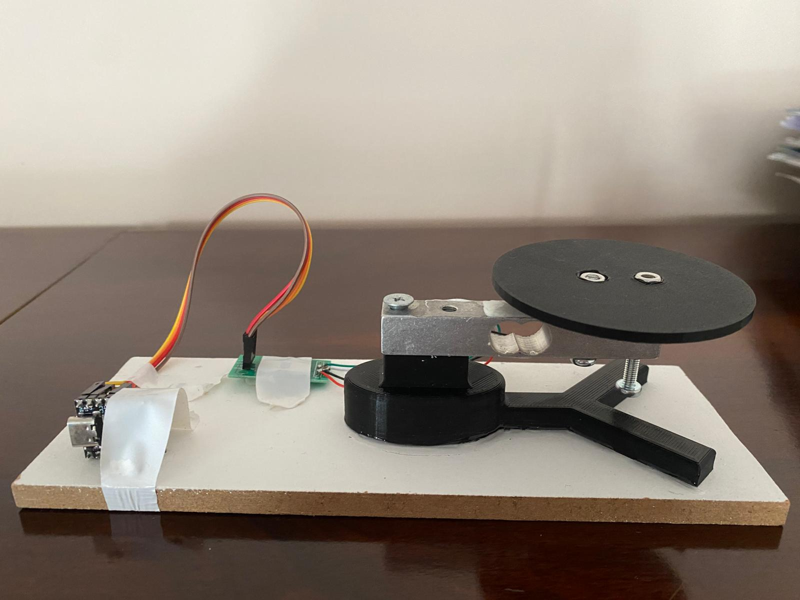
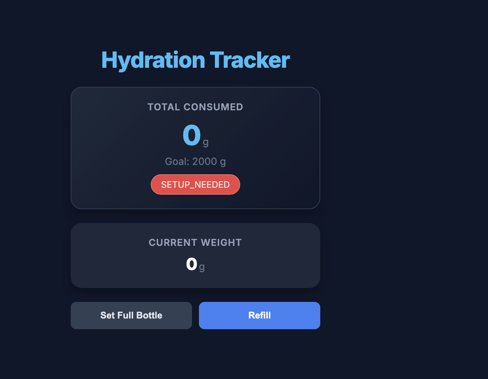
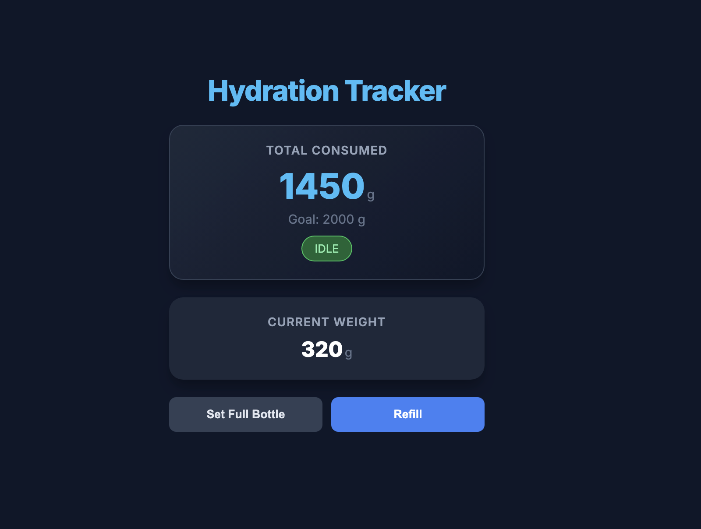
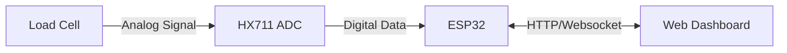

<h1 align="center">SmartCoaster Water Tracker</h1>

  

## Web Dashboard Interface

  
  

SmartCoaster is an IoT-based smart coaster constructed to automatically track your daily water consumption using an ESP32 microcontroller and an HX711 load cell amplifier.

## Features
- **Automatic Tracking:** Precisely measures water intake using weight differences, completely automatically.
- **Web Dashboard:** Provides real-time feedback via a built-in web server interface accessible on your local network.
- **Smart Logic:** Intelligently differentiates between drinking, bottle refilling, and environmental sensor noise.
- **Calibration Tool:** Comes with a built-in web tool for calibrating the scale.
- **Persistent Storage:** Saves calibration settings to NVS flash memory.

## Hardware Components
- ESP32-C3 Microcontroller
- HX711 24-bit ADC Module
- Load Cell (Strain Gauge)
- 5V Power Supply

## Block Diagram

## Quick Start
1. Open the `.ino` file in Arduino IDE or VS Code / PlatformIO.
2. Edit `SmartWaterTracker.ino` and replace `YOUR_WIFI_SSID` and `YOUR_WIFI_PASSWORD` with your actual Wi-Fi credentials.
3. Flash the code to your ESP32.
4. Open the Serial Monitor (115200 baud) to find the local IP address of your coaster.
5. Open that IP address in your browser to view the dashboard!
